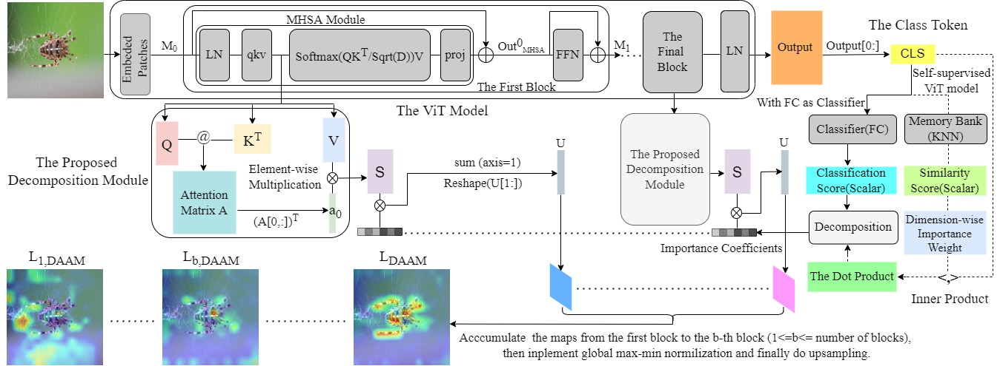

# Dynamic Accumulated Attention Map
This repository contains source code necessary to reproduce the explanation maps for ViT model's prediction in image classification task.
# Method Overview
To generate the attention flow for ViT model's prediction, an image is fed into a ViT model to obtain the decison-making [cls] token. During the calculation of the [cls] token, the semantic spatial map is stored by the proposed decomposition module. Then the semantic spactial map is combined linearly with the importance coefficients derived from the classification score, forming the attention map for a ViT block. According the residual structure in ViT, the attention flow is constructed by acculmulating attention maps from the first ViT block to the last ViT block. The method is depicted by the following, 

# Dynamic Accumulated Attention Map for Supervised ViT
_spider.gif)         _impala.gif)         _triumphal_arch.gif)

We provide an exmple of using our proposed DAAM algorithm to generate the attention flow for DeiT-Small-Patch16, please directly run the following python command in **Command Prompt** (Windows) or **Terminal** (Linux), 

<pre>
python VIT_DynamicAccumulatedAttentionMap_oneSample.py
</pre>

The pretrained model's weights are automatically downloaded into the pytorch cache by runing the above command. 

# Dynamic Accumulated Attention Map for Self-Supervised ViT
_hawk.gif)         _crane.gif)         bee_eater.gif)   

To generate the attention flow for self-supervised ViT models,

1. Download the pretrained model weights of the self-supervised ViT [DINO](https://github.com/facebookresearch/dino) and [XCiT](https://github.com/facebookresearch/xcit).
   
2. Generate the memory bank by following the algorithm in 2018 CVPR paper ["Unsupervised Feature Learning via Non-parameteric Instance Discrimination"](http://arxiv.org/pdf/1805.01978) and using the official pytorch released [code](https://github.com/zhirongw/lemniscate.pytorch).
 
3. Generate the explantion maps for all ViT blocks by using the proposed DAAM.
   
For convenience, we provid an implementation example using **DINO(ViT-Small-Patch8)** to demonstrate how the proposed **DAAM** works. 
The pretrained model weights are located in the `pretrainedmodels` folder. The corresponding memory bank can be downloaded from this [Google Drive link](https://drive.google.com/drive/folders/1PRvqtsTxCojx6iqXIqTxM8kA_GGDyFKb?usp=sharing). After downloading, please unzip them and then place the 4 files,

• "trainfeat.pth" 

• "testfeat.pth"

• "trainlabels.pth" 

• "testlabels.pth" 

into the directory `memorybank/DINO/ImageNet2012/`. Finally, please run the following command in **Command Prompt** (Windows) or **Terminal** (Linux),

<pre>
   python DINO_DAAM_Visualization_oneSample.py
</pre>    
